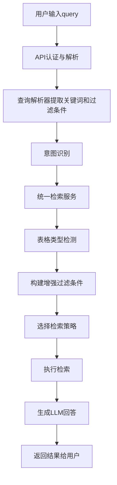

# 检索流程详细分析

## 1. 完整检索流程

### 1.1 总览



### 1.2 详细步骤

#### 1.2.1 用户输入query
- 用户通过API发送查询请求，例如：`帮我查询小鼠心脏的实验指标`
- API端点：`POST /query`
- 请求头：需要包含 `X-User-Id` 和 `X-Department`
- 请求体：包含 `text` 字段

#### 1.2.2 API认证与解析
- 在 `api/query.py` 中处理请求
- 验证请求头和请求体
- 解析query文本
- 构建AuthContext对象

#### 1.2.3 查询解析器
- 在 `services/query_parser.py` 中处理
- 函数：`parse_user_query`
- 提取关键词：`帮我查询小鼠心脏的实验指标`
- 提取过滤条件：`{'species': '小鼠', 'tissue': '心脏'}`
- 使用纯关键词提取策略（针对sample_query和project_query意图）

#### 1.2.4 意图识别
- 在 `services/intent_recognizer.py` 中处理
- 函数：`recognize_intent`
- 基于关键词识别意图，例如：`sample_query`

#### 1.2.5 统一检索服务
- 在 `services/query_service.py` 中处理
- 函数：`unified_query_service`
- **核心流程**：
  1. 重置token统计
  2. 初始化Embedding模型
  3. 获取索引
  4. **表格类型检测**（关键问题点）
  5. 构建增强过滤条件
  6. 选择检索策略
  7. 执行检索
  8. 生成LLM回答

### 1.3 关键步骤详解

#### 1.3.1 表格类型检测
```python
def _detect_target_table_type(query_text: str, intent: str) -> Optional[str]:
    # 1. 构建关键词列表
    project_keywords = ["实验平台", "物种", "样本类型", "细胞总量", "结团率", "细胞活率", "基因中位数", "细胞注释", "实验指标", "小鼠", "心脏", "组织", "t细胞", "细胞类型"]
    sample_keywords = ["产品", "样本大类", "组织类型", "样本处理方式", "建议送样量", "样本准备方法", "取样送样的注意事项"]
    
    # 2. 计算关键词匹配数量
    project_matches = sum(1 for kw in project_keywords if kw in lower_query)
    sample_matches = sum(1 for kw in sample_keywords if kw in lower_query)
    
    # 3. 选择匹配数更多的表格类型
    if project_matches > sample_matches:
        return "project_experience"
    elif sample_matches > project_matches:
        return "sample_preparation"
    
    # 4. 兜底策略
    if intent == "project_query":
        return "project_experience"
    elif intent == "sample_query":
        if sample_matches > 0:
            return "sample_preparation"
        else:
            return "project_experience"
    
    return "project_experience"  # 最终兜底
```

#### 1.3.2 构建增强过滤条件
```python
enhanced_filters = column_filters.copy() if column_filters else {}
if target_table_type:
    enhanced_filters["table_type"] = target_table_type
```

#### 1.3.3 选择检索策略
```python
if intent in ["sample_query", "project_query"]:
    # 样本准备查询和项目经验查询：纯关键词检索
    if enhanced_filters and len(enhanced_filters) > 0:
        search_result = await _strategy_structured_table(
            index, query_text, auth, enhanced_filters, llm_top_k
        )
    else:
        # 没有过滤条件，使用关键词检索
        search_result = await _strategy_structured_table(
            index, query_text, auth, {}, llm_top_k
        )
else:
    # 其他意图：根据是否有 Filters 决定走哪条路
    if enhanced_filters and len(enhanced_filters) > 0:
        search_result = await _strategy_structured_table(
            index, query_text, auth, enhanced_filters, llm_top_k
        )
    else:
        search_result = await _strategy_general_semantic(
            index, query_text, auth, semantic_top_k
        )
```

#### 1.3.4 执行检索
```python
# 创建检索器
retriever = index.as_retriever(
    similarity_top_k=10000,  # 设置一个很大的值，确保获取所有匹配结果
    filters=metadata_filters
)

# 执行检索
all_nodes = await retriever.aretrieve(search_text)
```

## 2. 可能的失败原因

### 2.1 表格类型检测错误
- **问题**：检测到错误的table_type，导致过滤条件错误
- **表现**：添加了错误的`table_type`到过滤条件，导致检索结果为空
- **原因**：
  1. 关键词匹配逻辑错误
  2. 关键词列表不完整
  3. 兜底策略不合理

### 2.2 增强过滤条件构建错误
- **问题**：错误地添加了table_type过滤条件
- **表现**：过滤条件中包含了不存在的table_type值
- **原因**：
  1. table_type检测错误
  2. 数据中没有对应的table_type值

### 2.3 检索执行错误
- **问题**：检索过程中出现错误
- **表现**：
  1. LlamaIndex检索失败
  2. PyMilvus降级查询失败
  3. 最终检索结果为空
- **原因**：
  1. 索引问题
  2. Milvus连接问题
  3. 过滤条件格式错误

### 2.4 数据预处理和检索的字段映射不一致
- **问题**：数据入库时的字段名与检索时的字段名不一致
- **表现**：检索时使用的字段名在数据中不存在
- **原因**：
  1. excel_processor中的字段映射错误
  2. 动态映射表中的映射错误
  3. 查询解析器中的字段映射错误

## 3. 当前流程与之前流程的关键差异

### 3.1 新增了表格类型检测
- **之前**：直接使用传入的意图，不检测表格类型
- **现在**：自动检测表格类型，并添加到过滤条件
- **影响**：如果检测错误，会导致过滤条件错误

### 3.2 新增了增强过滤条件
- **之前**：只使用解析出的过滤条件
- **现在**：自动添加table_type到过滤条件
- **影响**：如果table_type错误，会导致检索结果为空

### 3.3 改变了检索策略选择逻辑
- **之前**：简单根据意图选择策略
- **现在**：结合意图和过滤条件选择策略
- **影响**：可能导致策略选择错误

## 4. 调试建议

### 4.1 检查表格类型检测
- 在`_detect_target_table_type`函数中添加详细日志
- 验证检测结果是否正确

### 4.2 检查过滤条件
- 打印构建的增强过滤条件
- 验证过滤条件是否正确

### 4.3 检查检索执行
- 打印检索器的配置
- 打印执行检索的搜索词
- 检查检索结果数量

### 4.4 检查字段映射
- 验证excel_processor中的COLUMN_MAPPING
- 检查动态映射表
- 验证query_parser中的KEY_MAPPING

## 5. 修复方案

### 5.1 临时修复：移除表格类型检测
- 注释掉表格类型检测和增强过滤条件构建代码
- 恢复到之前的简单检索逻辑

### 5.2 永久修复：优化表格类型检测
- 完善关键词列表
- 优化匹配逻辑
- 增加调试日志
- 允许跳过table_type过滤

### 5.3 完善错误处理
- 增加检索失败的详细日志
- 完善降级策略
- 允许在检索失败时返回更有用的错误信息

## 6. 恢复到之前的检索逻辑

### 6.1 修改`unified_query_service`函数
```python
async def unified_query_service(
    auth: AuthContext,
    query_text: str,
    column_filters: Optional[Dict[str, str]] = None,
    llm_top_k: int = 8,
    semantic_top_k: int = 15,
    intent: str = "sample_query",
    websocket = None
) -> Dict[str, Any]:
    # 重置token统计，确保每次请求的token统计都是独立的
    from utils.token_counter import token_counter
    token_counter.reset_stats()
    
    _ensure_embed_model()
    
    # 1. 获取索引
    index = milvus_manager.get_existing_index(auth.department)
    if not index:
        return {
            "mode": "empty", 
            "answer": "抱歉，当前部门暂无数据索引。", 
            "sources": [], 
            "all_rows": []
        }

    # 2. 路由策略：根据意图和是否有 Filters 决定走哪条路
    search_result = {}
    
    # 🔍 调试日志：看看 Service 到底收到了什么
    logger.info(f"🛡️ [Service] 收到请求 -> Query: '{query_text}' | Filters: {column_filters} | Intent: {intent}")
    
    # 基于意图的检索策略路由 - 恢复到之前的逻辑
    if intent in ["sample_query", "project_query"]:
        # 样本准备查询和项目经验查询：纯关键词检索
        logger.info(f"🛤️ 命中策略: [{intent} - 纯关键词检索]")
        # 检查是否有过滤条件
        if column_filters and len(column_filters) > 0:
            # 有过滤条件，使用结构化表格检索
            search_result = await _strategy_structured_table(
                index, query_text, auth, column_filters, llm_top_k
            )
        else:
            # 没有过滤条件，使用关键词检索（不使用语义检索）
            logger.info(f"📝 对于 {intent} 意图，没有过滤条件，使用查询文本作为关键词进行检索")
            search_result = await _strategy_structured_table(
                index, query_text, auth, {}, llm_top_k
            )
    else:
        # 其他意图：根据是否有 Filters 决定走哪条路
        logger.info(f"🛤️ 命中策略: [其他意图 - 通用检索策略]")
        if column_filters and len(column_filters) > 0:
            logger.info("🛤️ 子策略: [结构化表格检索]")
            search_result = await _strategy_structured_table(
                index, query_text, auth, column_filters, llm_top_k
            )
        else:
            logger.info("🛤️ 子策略: [通用语义检索]")
            search_result = await _strategy_general_semantic(
                index, query_text, auth, semantic_top_k
            )

    # 3. 生成回答
    all_rows = search_result.get("all_rows", [])
    best_rows = search_result.get("best_rows", [])
    
    logger.info(f"📊 检索结果总数: {len(all_rows)} 条")
    logger.info(f"🔝 best_rows数量: {len(best_rows)}")
    
    # 调用_generate_summary函数
    logger.info("🚀 准备调用_generate_summary函数")
    llm_answer = await _generate_summary(
        query_text=query_text if query_text else str(column_filters),
        context_nodes=best_rows,
        intent=intent,
        all_retrieved_rows=all_rows,
        websocket=websocket
    )
    
    # 获取token统计信息
    token_stats = token_counter.get_total_stats()
    
    result = {
        "mode": search_result["mode"],
        "answer": llm_answer,
        "sources": best_rows,
        "all_rows": search_result["all_rows"],
        "token_stats": token_stats
    }
    
    return result
```

## 7. 结论

当前检索流程与之前的主要差异在于**新增了表格类型检测和增强过滤条件**，这可能是导致检索失败的主要原因。建议：

1. **临时修复**：移除表格类型检测和增强过滤条件，恢复到之前的简单检索逻辑
2. **永久修复**：优化表格类型检测，增加调试日志，完善错误处理
3. **字段映射检查**：确保数据预处理和检索的字段映射一致

通过这些修复，可以恢复检索功能，同时保留新版本的其他优化。